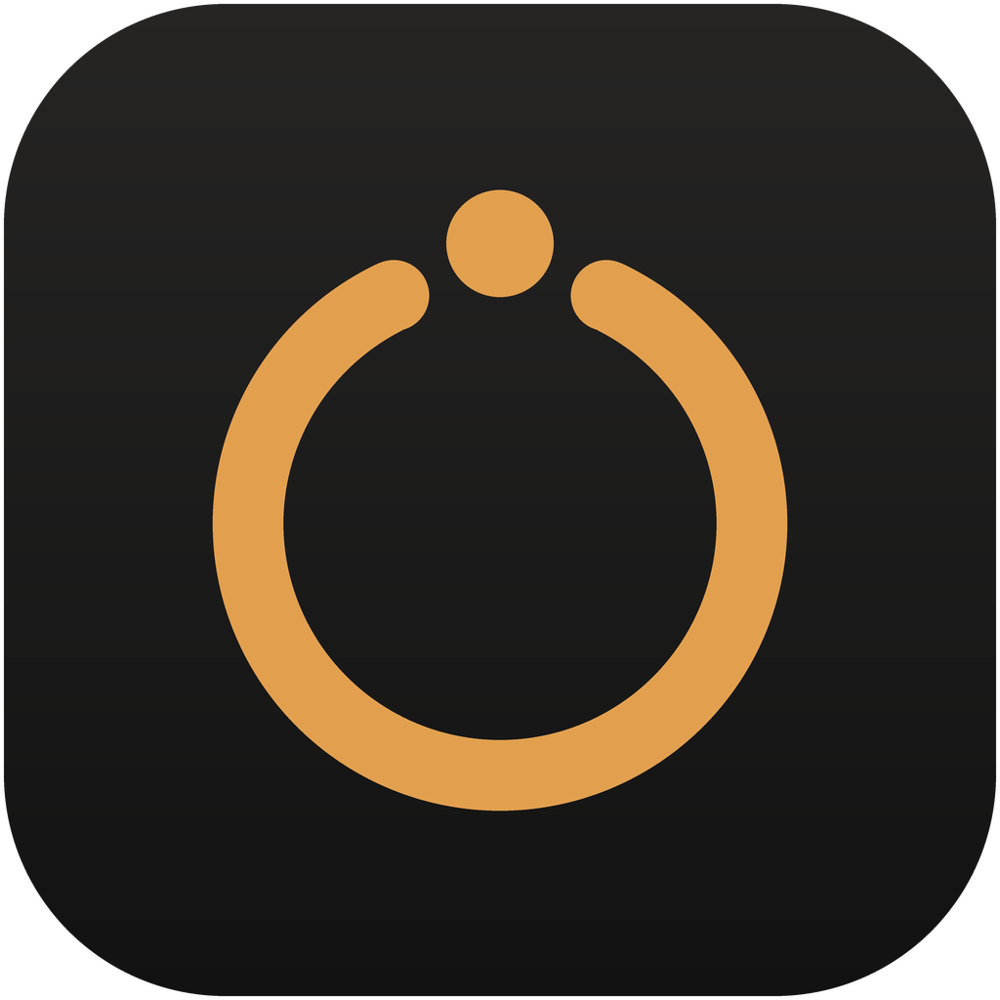

<p align="center">
  
</p>
<h1 align="center">Unvara</h1>
<p align="center">Private AI that runs on your own computer.</p>
<p align="center"><a href="README.md">English</a> · <a href="README.ru.md">Русский</a></p>

---

Unvara is a free, open-source desktop app for running AI models locally — a chat and a coding agent in one window,
with no account and no filters. It checks your hardware, recommends models that run well on it, downloads them in one
click and sets up the right engine for your graphics card automatically. Cloud models (Claude, GPT, Gemini and others)
are there too if you want them.

## Features

- **Picked for your PC.** A quick hardware check (graphics card, memory, disk) and three suggestions — fastest,
  balanced, best quality — with the expected speed and the context each model gets on your machine.
- **One-click downloads.** A curated catalog, uncensored models first, plus live search across GGUF models on
  Hugging Face. Resumable downloads, checked against SHA-256.
- **The right engine, automatically.** [llama.cpp](https://github.com/ggml-org/llama.cpp) with CUDA on NVIDIA, Vulkan
  on AMD and Intel, CPU as a fallback. Large mixture-of-experts models keep their experts in RAM, so a 35B model runs on
  an 8 GB card.
- **Chat or Agent.** Chat is a plain conversation. Agent can read and edit files, run commands and use connectors;
  small local models get a trimmed toolset so they stay reliable.
- **Connectors (MCP).** Files, web pages, web search, a browser, memory, GitHub — or any MCP server. Unvara installs what
  they need to run (Bun, uv) when your PC doesn't have it.
- **Bring your own models.** Import GGUF files from any folder, LM Studio or Ollama without copying them.
- **Tunable.** Context window with a live memory estimate, context-cache precision, flash attention, GPU layers,
  sampling — per model.

## Requirements

- Windows 10 or 11, 64-bit
- 8 GB of RAM at least; 16 GB or more recommended
- A graphics card is optional: NVIDIA (CUDA), AMD or Intel (Vulkan). Without one, models run on the processor.

macOS and Linux builds are planned.

## Uncensored models

Some models in the catalog have had their refusals removed ("abliterated", "heretic" or fine-tuned). They can
produce any kind of content. Unvara is for adults: you confirm you are 18 or older on first launch and you are
responsible for how you use these models.

## Privacy

Models run on your computer and your chats stay on it. There is no telemetry and no account. Unvara goes online only to:

- download models you pick, from Hugging Face or a mirror you choose (search runs when you open it);
- download the engine for your graphics card, file-search tools and connector runtimes, from GitHub, when needed;
- check for a newer model catalog (a signed file from this repository, via jsDelivr or GitHub) at startup;
- talk to a cloud provider — only if you connect one. OpenCode's free cloud models are off until you turn them on.

## Building from source

You need [Bun](https://bun.sh) 1.3 or newer.

```sh
bun install
bun run dev:desktop              # run the desktop app in development mode

cd packages/desktop
bun run build && bun run package:win   # build the Windows installer into dist/
```

The model catalog is generated from `catalog/sources.yaml` with `bun script/catalog/build.ts`.

## Credits

Unvara is a fork of [OpenCode](https://github.com/anomalyco/opencode) and runs models with
[llama.cpp](https://github.com/ggml-org/llama.cpp). Model fitting adapts work from llmfit and
[Jan](https://github.com/menloresearch/jan). See [THIRD_PARTY_NOTICES.md](THIRD_PARTY_NOTICES.md).

## License

MIT — see [LICENSE](LICENSE).
