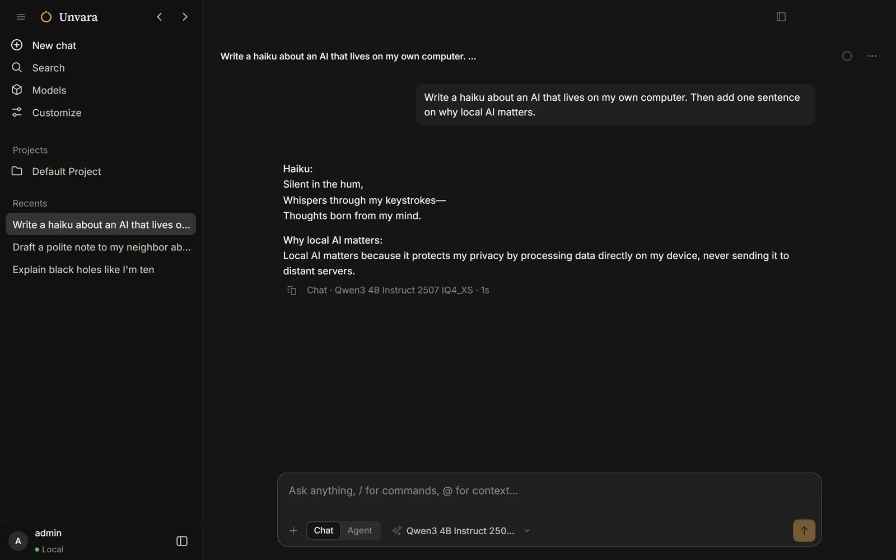
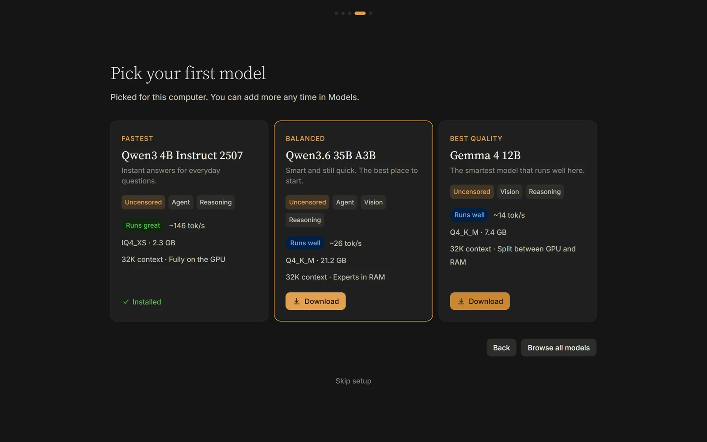
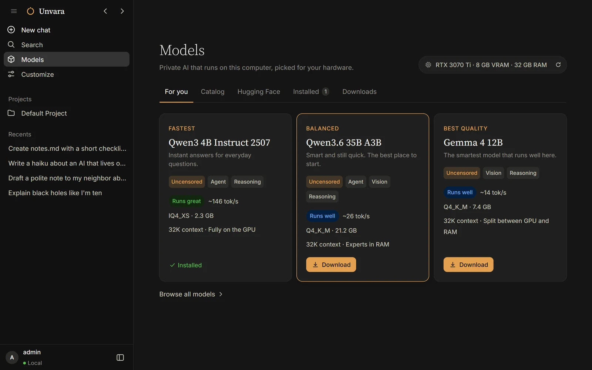
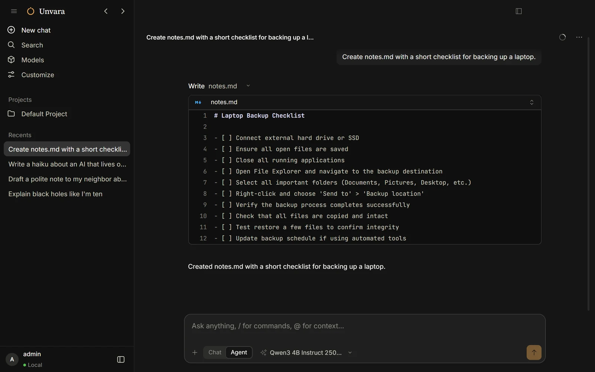

<p align="center">
  
</p>
<h1 align="center">Unvara</h1>
<p align="center">
  <b>Private AI that runs on your own computer.</b><br>
  A chat and a coding agent for local models — no account, no cloud, no filters.
</p>
<p align="center">
  <a href="https://github.com/Chumbayoumba/unvara/releases/latest"></a>
  <a href="https://github.com/Chumbayoumba/unvara/releases"></a>
  
  <a href="LICENSE"></a>
  <a href="https://github.com/Chumbayoumba/unvara/actions/workflows/ci.yml"></a>
</p>
<p align="center">
  <a href="https://github.com/Chumbayoumba/unvara/releases/latest"><b>Download for Windows</b></a> ·
  <a href="README.ru.md">Русский</a>
</p>



Unvara is a free, open-source desktop app for running AI models locally. It checks your hardware, recommends models
that run well on it, downloads them in one click and sets up the right engine for your graphics card. Everything stays
on your PC. Cloud models (Claude, GPT, Gemini and others) are there too if you want them.

## Download

Get **`unvara-win-x64.exe`** from the [latest release](https://github.com/Chumbayoumba/unvara/releases/latest) and run
it. Unvara updates itself from new releases.

The installer is not code-signed yet (a [SignPath](CODE_SIGNING.md) application is in progress), so Windows SmartScreen
may say "Windows protected your PC". Click **More info → Run anyway**.

**Requirements:** Windows 10 or 11 (64-bit), 8 GB of RAM (16 GB or more recommended). A graphics card is optional:
NVIDIA (CUDA), AMD or Intel (Vulkan); without one, models run on the processor. macOS and Linux builds are planned.

## Features

### Picked for your PC

A quick hardware check and three suggestions — fastest, balanced, best quality — with the speed and context each model
gets on your machine. Large mixture-of-experts models keep their experts in RAM, so a 35B model runs on an 8 GB card.



### Models, one click away

A curated catalog with uncensored models first, live search across GGUF models on Hugging Face, and import from any
folder, LM Studio or Ollama without copying. Downloads resume after a dropped connection and are checked against
SHA-256.



### Chat or Agent

Chat is a plain conversation. Agent reads and edits files, runs commands and uses connectors; small local models get a
trimmed toolset so they stay reliable.



### And also

- **The right engine, automatically.** [llama.cpp](https://github.com/ggml-org/llama.cpp) with CUDA on NVIDIA, Vulkan on
  AMD and Intel, CPU as a fallback — installed and switched for you.
- **Connectors (MCP).** Files, web pages, web search, a browser, memory, GitHub — or any MCP server. Unvara installs what
  they need (Bun, uv) when your PC doesn't have it.
- **Tunable.** Context window with a live memory estimate, context-cache precision, flash attention, GPU layers and
  sampling, per model.
- **Your language.** English, Russian, Chinese, Japanese, Spanish, Portuguese, German and French; Unvara follows your
  system language.

## Uncensored models

Some models in the catalog have had their refusals removed ("abliterated", "heretic" or fine-tuned). They can produce
any kind of content. Unvara is for adults: you confirm you are 18 or older on first launch and you are responsible for
how you use these models.

## Privacy

Models run on your computer and your chats stay on it. There is no telemetry and no account. Unvara goes online only to
download what you ask for, check for a newer model catalog and app updates, and talk to a cloud provider if you connect
one. The details are in [PRIVACY.md](PRIVACY.md).

## FAQ

**Is it really free?** Yes. Unvara is MIT-licensed and local models cost nothing to run. Cloud models are billed by
their providers, with your own API key.

**Does it work offline?** Yes, once a model is downloaded. The installer already contains a CPU and a Vulkan engine.

**Which model should I start with?** The one the setup marks as *Balanced*. It is picked for your hardware.

**Where are my models?** In the models folder shown in *Customize → Local AI* (by default on the drive with the most free
space, e.g. `D:\Unvara\models`).

**Something broke.** *Help → Export Logs…*, then [open an issue](https://github.com/Chumbayoumba/unvara/issues/new/choose)
with the file.

## Building from source

You need [Bun](https://bun.sh) 1.3 or newer.

```sh
bun install
bun run dev:desktop              # run the desktop app in development mode

cd packages/desktop
bun run build && bun run package:win   # build the Windows installer into dist/
```

The model catalog is generated from `catalog/sources.yaml` with `bun script/catalog/build.ts`. Releases are described in
[RELEASING.md](RELEASING.md).

## Credits

Unvara is a fork of [OpenCode](https://github.com/anomalyco/opencode) and runs models with
[llama.cpp](https://github.com/ggml-org/llama.cpp). Model fitting adapts work from llmfit and
[Jan](https://github.com/menloresearch/jan). See [THIRD_PARTY_NOTICES.md](THIRD_PARTY_NOTICES.md).

## License

MIT — see [LICENSE](LICENSE).
