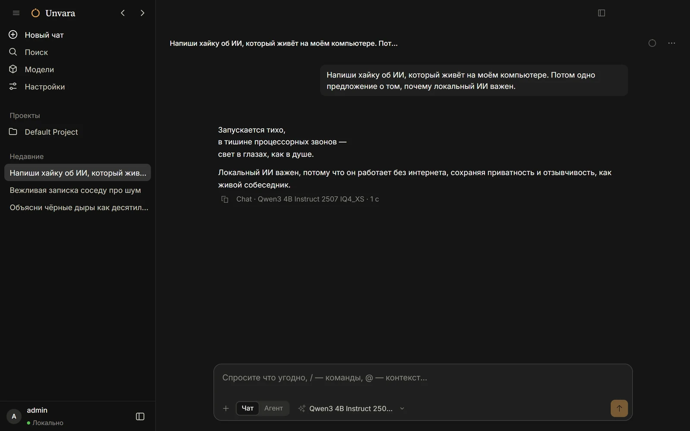
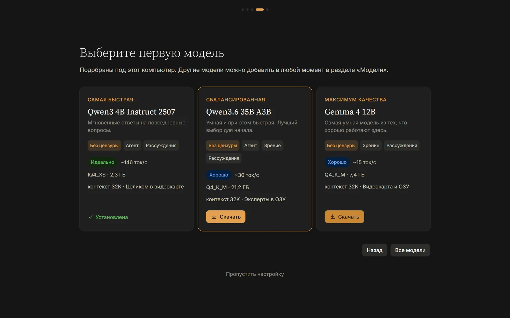
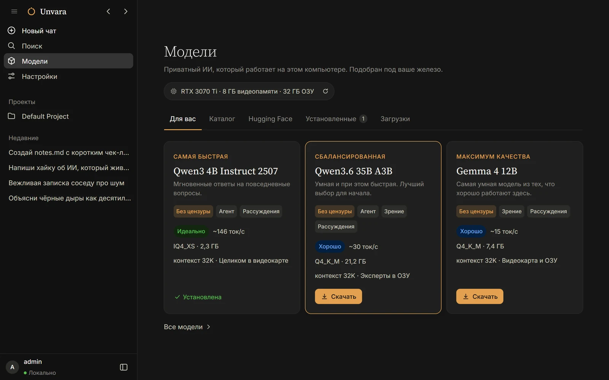
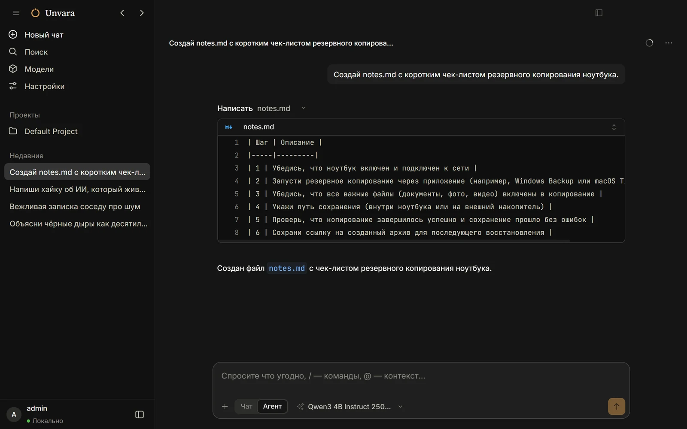

<p align="center">
  
</p>
<h1 align="center">Unvara</h1>
<p align="center">
  <b>Приватный ИИ, который работает на вашем компьютере.</b><br>
  Чат и агент для работы с кодом на локальных моделях — без аккаунта, без облака, без фильтров.
</p>
<p align="center">
  <a href="https://github.com/Chumbayoumba/unvara/releases/latest"></a>
  <a href="https://github.com/Chumbayoumba/unvara/releases"></a>
  
  <a href="LICENSE"></a>
  <a href="https://github.com/Chumbayoumba/unvara/actions/workflows/ci.yml"></a>
</p>
<p align="center">
  <a href="https://github.com/Chumbayoumba/unvara/releases/latest"><b>Скачать для Windows</b></a> ·
  <a href="README.md">English</a>
</p>



Unvara — бесплатное приложение с открытым кодом, чтобы запускать ИИ-модели у себя на компьютере. Оно проверяет железо,
советует модели, которые на нём хорошо работают, скачивает их в один клик и само ставит подходящий движок под вашу
видеокарту. Всё остаётся на вашем ПК. Облачные модели (Claude, GPT, Gemini и другие) тоже можно подключить, если нужно.

## Скачать

Скачайте **`unvara-win-x64.exe`** из [последнего релиза](https://github.com/Chumbayoumba/unvara/releases/latest) и
запустите. Дальше Unvara обновляется сама.

Установщик пока без цифровой подписи (заявка в [SignPath](CODE_SIGNING.md) в работе), поэтому Windows SmartScreen может
показать «Windows защитила компьютер». Нажмите **Подробнее → Выполнить в любом случае**.

**Требования:** Windows 10 или 11 (64 бит), 8 ГБ оперативной памяти (лучше 16 ГБ и больше). Видеокарта не обязательна:
NVIDIA (CUDA), AMD или Intel (Vulkan); без неё модели работают на процессоре. Версии для macOS и Linux в планах.

## Возможности

### Подбор под ваш ПК

Быстрая проверка железа и три варианта — самая быстрая, сбалансированная и максимум качества — со скоростью и размером
контекста, которые модель получит на вашей машине. У больших MoE-моделей эксперты живут в оперативной памяти, поэтому
модель на 35B работает на видеокарте с 8 ГБ.



### Модели в один клик

Свой каталог, где сначала идут модели без цензуры, живой поиск GGUF-моделей на Hugging Face и импорт из любой папки,
LM Studio или Ollama без копирования. Загрузки докачиваются после обрыва и проверяются по SHA-256.



### Чат или Агент

Чат — просто разговор. Агент читает и правит файлы, запускает команды и пользуется коннекторами; маленьким локальным
моделям достаётся урезанный набор инструментов, чтобы они не путались.



### А ещё

- **Нужный движок сам.** [llama.cpp](https://github.com/ggml-org/llama.cpp): CUDA на NVIDIA, Vulkan на AMD и Intel,
  процессор как запасной вариант — ставится и переключается без вашего участия.
- **Коннекторы (MCP).** Файлы, веб-страницы, поиск, браузер, память, GitHub — или любой MCP-сервер. Если на ПК нет того,
  что им нужно для запуска (Bun, uv), Unvara поставит это сама.
- **Тонкая настройка.** Окно контекста с оценкой памяти, точность кэша контекста, flash attention, слои на видеокарте
  и параметры генерации — для каждой модели.
- **Ваш язык.** Русский, английский, китайский, японский, испанский, португальский, немецкий и французский; Unvara
  берёт язык системы.

## Модели без цензуры

У части моделей в каталоге убраны отказы («abliterated», «heretic» или дообучение). Они могут создавать любой контент.
Unvara — для взрослых: при первом запуске вы подтверждаете, что вам есть 18 лет, и сами отвечаете за то, как
используете такие модели.

## Приватность

Модели работают на вашем компьютере, и переписка остаётся на нём. Никакой телеметрии и никакого аккаунта. В интернет
Unvara выходит только чтобы скачать то, что вы попросили, проверить новый каталог моделей и обновления приложения и
обратиться к облачной модели, если вы её подключили. Подробно — в [PRIVACY.md](PRIVACY.md).

## Вопросы и ответы

**Это правда бесплатно?** Да. Unvara распространяется по лицензии MIT, а локальные модели ничего не стоят. Облачные
модели оплачиваются у их провайдеров по вашему API-ключу.

**Работает без интернета?** Да, когда модель уже скачана. В установщике уже есть движок для процессора и Vulkan.

**С какой модели начать?** С той, что мастер отметил как *Сбалансированная*. Она подобрана под ваше железо.

**Где лежат модели?** В папке моделей из *Настройки → Локальный ИИ* (по умолчанию на диске, где больше всего места,
например `D:\Unvara\models`).

**Что-то сломалось.** *Справка → Экспортировать журналы…*, затем
[создайте issue](https://github.com/Chumbayoumba/unvara/issues/new/choose) и приложите файл.

## Сборка из исходников

Нужен [Bun](https://bun.sh) 1.3 или новее.

```sh
bun install
bun run dev:desktop              # запустить приложение в режиме разработки

cd packages/desktop
bun run build && bun run package:win   # собрать установщик для Windows в dist/
```

Каталог моделей собирается из `catalog/sources.yaml` командой `bun script/catalog/build.ts`. Как выпускать релизы —
в [RELEASING.md](RELEASING.md).

## Благодарности

Unvara — форк [OpenCode](https://github.com/anomalyco/opencode), модели запускает
[llama.cpp](https://github.com/ggml-org/llama.cpp). Подбор моделей под железо основан на llmfit и
[Jan](https://github.com/menloresearch/jan). Подробнее — в [THIRD_PARTY_NOTICES.md](THIRD_PARTY_NOTICES.md).

## Лицензия

MIT — см. [LICENSE](LICENSE).
